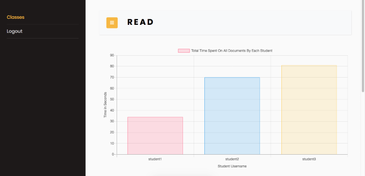

# READ
Read is a web application for teachers and students primarily focused on document sharing. Teachers can open virtual classes which students can enroll into, providing an easy way to share documents to all students of a class. Viewing documents comes with two additional features:  **facial recognition and eye tracking**. Students' identities are authenticated using facial recognition while eye tracking is used to ensure that students are looking at documents. Teachers are also able to look at statistics based on time spent viewing documents for each class. `Refer to 'Final Report.docx' for details.`

## Installation
* Make sure you have python3 installed
* Create a virtual environment
* Source the virtual environment
* `cd` to the directory: `spring2020.cse327.1.6/web_app/`
* Run `pip install -r requirements.txt`
* `cd` to `spring2020.cse327.1.6/web_app/mysite/`
* Run `python manage.py runserver --noreload --nothreading`
    * NOTE: running with the `--noreload` and `--nothreading` options means changes are not automatically displayed in the django app, but this is necessary for the facial recognition to work.
* Go to `http://127.0.0.1:8000/read/` (port may be different)

 
#### NB: To use the Facial Recognition API, Dlib must be installed. The installation procedure is detailed [here](https://github.com/ageitgey/face_recognition/issues/175).
